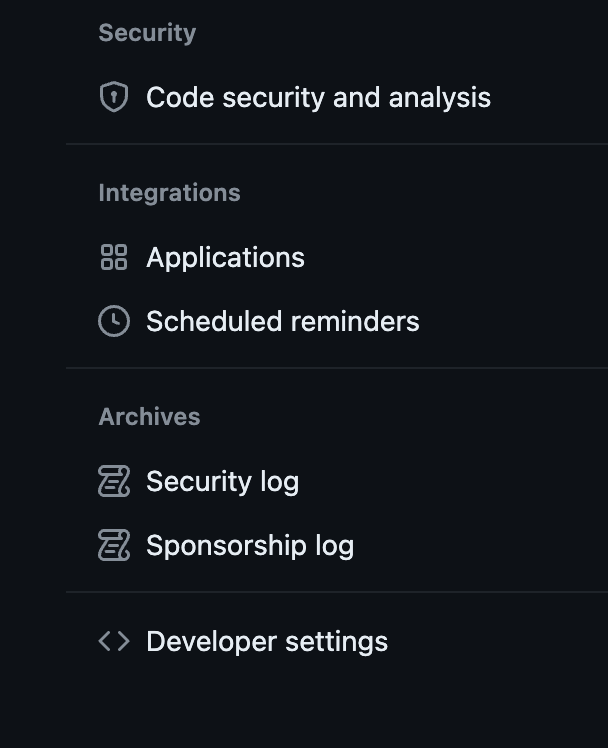

```
Your name and email address were configured automatically based
on your username and hostname. Please check that they are accurate.
You can suppress this message by setting them explicitly. Run the
following command and follow the instructions in your editor to edit
your configuration file:

    git config --global --edit

After doing this, you may fix the identity used for this commit with:

    git commit --amend --reset-author

 1 file changed, 1 insertion(+)
error: remote origin already exists.
Username for 'https://github.com': albertphx
Password for 'https://albertphx@github.com':
remote: Permission to AlbertPhx/albertphx.github.io.git denied to AlbertPhx.
fatal: unable to access 'https://github.com/AlbertPhx/albertphx.github.io.git/': The requested URL returned error: 403
```

When you have this issues, you might want to enter your github username and password, but actually it requires you to enter your "Personal access tokens", you can go to the settings page and find the "Personal access tokens" button then click it.


After you see this page you can generate the your own personal access tokens and copy and paste to your terminal. Then you can conect your github from your local.


