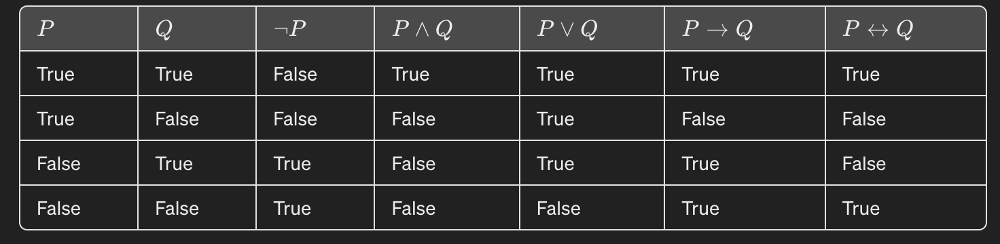

- Logical operators
  - ¬ (Not): Represents logical negation.
  - ∧ (And): Represents logical conjunction.
  - ∨ (Or): Represents logical disjunction.
  - → (Implies): Represents the logical implication, indicating a "if ... then ..." relationship.
  - ↔ (If and only if/Iff): Represents a biconditional relationship, indicating "if and only if".

- Propositional connectives
  - 2 -place(binary): ∧ (conjunction),v(disjunction), → (implication)
  - 1 -place(unary) : ¬ (negation)
  - 0 -place : bottom and T (top)
- Satisfiability
  - A propositional formula F is satisfiable if some interpretation(各種可能性) satisfies F
  - a least one interpretation satifty!
  - A set of propositional formulas is satisfiable if some interpretation satisfies all formulas in the set.
  - For example
    1. (p -> (q->p)) => (true->(true-> true)) => true (correct!)
    2. (p -> (p->q)) => (true->(true-> true)) => true (correct!)
    3. (p ->
